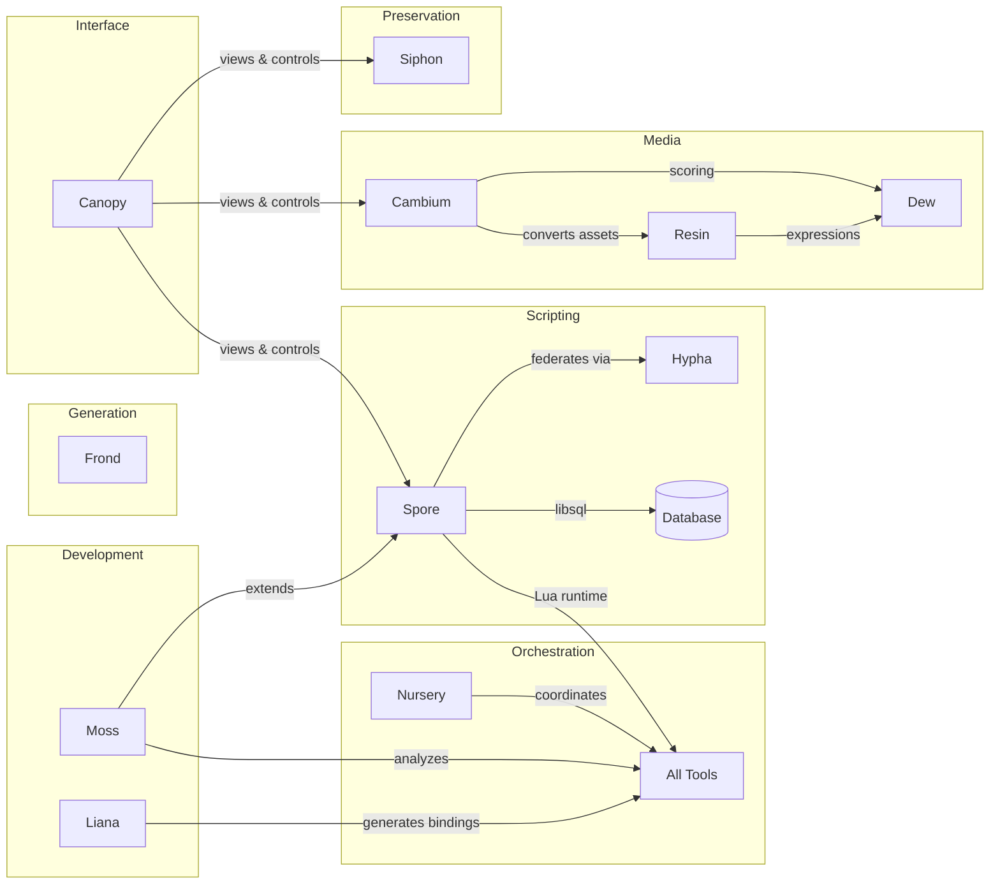

# About Rhizome

Rhizome is an ecosystem of tools for **programmable creativity**—software that treats code, worlds, and media as malleable structures rather than opaque artifacts.

## Philosophy

The projects share common design principles:

### Generalize, Don't Multiply

Prefer one flexible solution over many specialized ones. Composability reduces cognitive load and maintenance burden.

- **Moss**: Three primitives (view, edit, analyze) instead of 100 specialized tools
- **Spore**: Lua runtime exposes libsql directly—apps define their own schemas
- **Resin**: Unified `Field<I, O>` trait for textures, audio, and any continuous domain

### Structure Over Text

Return structure, not prose. Structured data composes; text requires parsing.

Hierarchy implies trees. Code (AST), files (directories), entities (graphs), media (node graphs)—design operations that work on these structures directly.

### Lazy by Default

Build descriptions, evaluate on demand. Don't pay for what you don't use.

- **Resin**: Procedural textures and audio are lazy fields, materialized only when rendered
- **Moss**: Skeleton views extract structure without loading entire files
- **Spore**: Integrations are loaded on demand, not at startup

### Plugin Architecture

Optional, domain-specific, or heavyweight features belong in plugins:

- Core stays lean
- Heavy dependencies are isolated
- Users can swap implementations
- Third-party extensions use the same interfaces as built-in features

### Works Anywhere

Real-world code is messy. Real-world data is heterogeneous. Tools should:

- Handle legacy systems without requiring refactoring first
- Degrade gracefully when parsing fails
- Support incremental improvement
- Not impose architectural opinions unless asked

### Multiple Paradigms

"One paradigm" is always wrong. The answer is always "multiple, fluid, user-chosen."

How do you find a friend's apartment? Ask the doorman, check the directory, call them, remember "3rd floor end of hall", wander and look at numbers, or some combination. Real life gives you spatial, ask, remember, browse, index, shortcut. Filesystem gives you hierarchy + search. That's it.

The poverty isn't "wrong paradigm." It's "only one paradigm."

Same user, different moments: sometimes keyboard, sometimes click; tired vs focused; familiar vs exploring. Different users: expert wants density, novice wants guidance. "Know your user" is wrong. "Support multiple modes of being a user" is right.

Don't pick the right paradigm. Offer multiple. Let users switch based on context, task, preference.

### Structure for Agents

"Agent" means anything trying to understand or interact with systems—human or AI.

The current approach forces agents to interpret unstructured things:
- AI looks at screenshots to use apps
- LLMs read documentation to understand APIs
- Humans hunt for tools to convert formats
- Chat logs are the only context for AI roleplay

This is fragile, slow, lossy, and requires guessing. Rhizome's approach: **make the world structured, don't force interpretation.**

| Problem | Interpretation approach | Structured approach |
|---------|------------------------|---------------------|
| Understand large codebase | Read it (can't) | **Moss**: Query structured code intelligence |
| Use platform APIs | Read docs, write boilerplate | **Liana**: Codegen from specs (OpenAPI, headers) |
| Convert format A → B | Hunt for exotic tools | **Cambium**: Unified type-driven pipelines |
| AI with persistent context | Linear chat history (amnesia) | **Lotus**: Inject world state, not just chat |
| Universal primitives | Different stdlib per language | **Pith**: Capability-based interfaces on WASI |

The specs already exist—OpenAPI, headers, WASI, ASTs. The structure is there. Rhizome projects make it accessible.

### Compose With What Exists

Tools should fit into your infrastructure, not replace it. Vendor lock-in is usually framed as exit friction—hard to leave. But it's also *entry* friction—you have to adopt their whole stack to try one thing.

If a tool composes with what you already have:
- Lower barrier to try it (don't have to change anything else)
- Lower barrier to leave (nothing else depends on it)
- Works with your existing setup (tailscale, your servers, your repos)
- Doesn't create parallel universes of state that drift apart

The opposite: "use our VM, our sync, our infrastructure." Now you have two of everything, they're never quite in sync, and you're locked in both directions.

Rhizome projects aim to be tools, not platforms. Use them with whatever else you have.

## The Name

A rhizome is a root system that grows horizontally, sending out shoots at intervals. Unlike trees with a single trunk, rhizomes form interconnected networks where any point can connect to any other.

Our projects are designed the same way: independent tools that compose well together, each useful alone but more powerful in combination.

## Projects

| Project | Domain | Key Idea |
|---------|--------|----------|
| [Moss](/projects/moss) | Code intelligence | AST-aware navigation and editing across 98 languages |
| [Hypha](/projects/hypha) | Federation | Authoritative handoff protocol for persistent worlds |
| [Resin](/projects/resin) | Media generation | Composable procedural primitives for meshes, audio, textures |
| [Frond](/projects/frond) | Game primitives | State machines, controllers, common gameplay patterns |
| [Dew](/projects/dew) | Expressions | Minimal expression language (WGSL, Cranelift, Lua) |
| [Liana](/projects/liana) | API bindings | IR and codegen for cross-language bindings |
| [Cambium](/projects/cambium) | Pipelines | Type-driven route planning for data conversion |
| [Canopy](/projects/canopy) | UI | Universal client with control plane for any data source |
| [Siphon](/projects/siphon) | Preservation | Legacy software lifting from obsolete runtimes |
| [Nursery](/projects/nursery) | Configuration | Unified tool config and project scaffolding from seeds |
| [Spore](/projects/spore) | Runtime | Lua runtime with plugin system for ecosystem integration |
| [Pith](/projects/pith) | Standard library | Capability-based interfaces inspired by WASI |
| [Flora](/projects/flora) | Monorepo | Lua-based tools, scaffolds, and orchestration |
| [Trellis](/projects/trellis) | Macros | Composable derive macros for Rust |

## Integration

The projects are designed to work together:

- **Nursery** coordinates tools via schema-validated manifests
- **Moss** provides code intelligence for all projects
- **Spore** provides Lua runtime with libsql persistence and **Moss** integration
- **Hypha** enables authoritative handoff between Spore servers
- **Resin** uses **Dew** for procedural expressions
- **Frond** provides game design primitives
- **Cambium** orchestrates asset conversion pipelines
- **Liana** generates API bindings across the ecosystem
- **Canopy** provides UI for viewing and controlling any project
- **Siphon** lifts legacy software into modern web runtimes

## Related Projects

Independent projects that share Rhizome's design philosophy:

| Project | Domain | Key Idea |
|---------|--------|----------|
| [rescribe](https://github.com/pterror/rescribe) | Document conversion | Lossless IR for format translation (pandoc, but fidelity-preserving) |
| [burn-models](https://github.com/pterror/burn-models) | ML inference | Deep learning in pure Rust—no Python, multiple backends |
| [ooxml](https://github.com/pterror/ooxml) | Office formats | Structural parsing for docx/xlsx/pptx |
