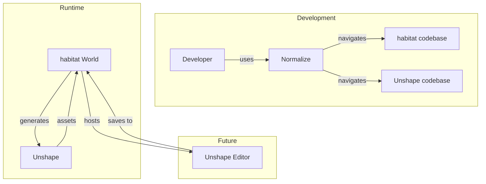
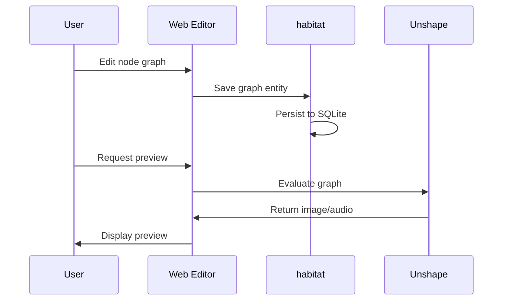

# Integration

**See also:** [Architecture](/architecture) (project structure), [Projects](/projects/) (individual project details)

How rhi projects work together.

## Overview

While each project is useful standalone, they're designed to compose:



## Normalize + any project

Normalize provides code intelligence for any Rust or TypeScript codebase:

```bash
# Navigate habitat's entity system
normalize view habitat/crates/core/src/entity.rs

# Find all Lua bindings in habitat
normalize view habitat/ --calls "lua.*"

# Analyze Unshape's complexity hotspots
normalize analyze unshape/crates/ --complexity

# Search for trait implementations
normalize view unshape/ --type impl
```

## Unshape + habitat

Unshape generates procedural assets that habitat worlds can use:

### Procedural textures for rooms

```rust
// Unshape: Generate a procedural wall texture
let wall = perlin()
    .scale(8.0)
    .remap(-1.0, 1.0, 0.3, 0.7)
    .colorize(gradient![
        0.0 => rgb(0.2, 0.15, 0.1),
        1.0 => rgb(0.4, 0.35, 0.3),
    ]);

wall.render(512, 512).save("wall.png");
```

```lua
-- habitat: Use the texture in a room
room.texture = "/assets/wall.png"
```

### Procedural audio for ambience

```rust
// Unshape: Generate ambient sounds
let wind = noise_osc(NoiseType::Pink)
    .filter(lowpass(200.0))
    .amplitude(0.3);

let rain = impulse_train(8.0)
    .filter(bandpass(2000.0, 0.5))
    .amplitude(0.1);

mix(wind, rain).render_to("ambience.wav", 44100, 10.0);
```

### Procedural meshes for objects

```rust
// Unshape: Generate a procedural gem
let gem = icosphere(2)
    .deform(|p| p + noise3d(p * 3.0) * 0.1)
    .extrude_faces(0.1);

gem.export("gem.glb");
```

## Future: habitat hosts Unshape editor

A longer-term integration: habitat as a persistent backend for a Unshape node graph editor.



Benefits:
- **Persistence**: Graph saved as habitat entity with full history
- **Collaboration**: Multiple users edit the same graph
- **Scripting**: Lua scripts can manipulate graphs programmatically
- **Versioning**: Entity revision history provides undo/branching

## Library usage

All projects expose their core as Rust libraries:

```toml
# Cargo.toml
[dependencies]
normalize = { git = "https://github.com/rhi-zone/normalize" }
habitat-core = { git = "https://github.com/rhi-zone/habitat" }
unshape = { git = "https://github.com/rhi-zone/unshape" }
```

This allows building custom tools that combine capabilities:

```rust
use normalize::view::skeleton;
use unshape::texture::perlin;
use habitat_core::entity::Entity;

// Analyze code structure, generate assets, store in world
```
